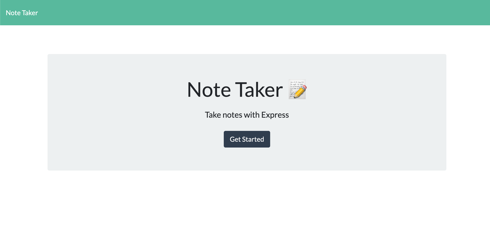
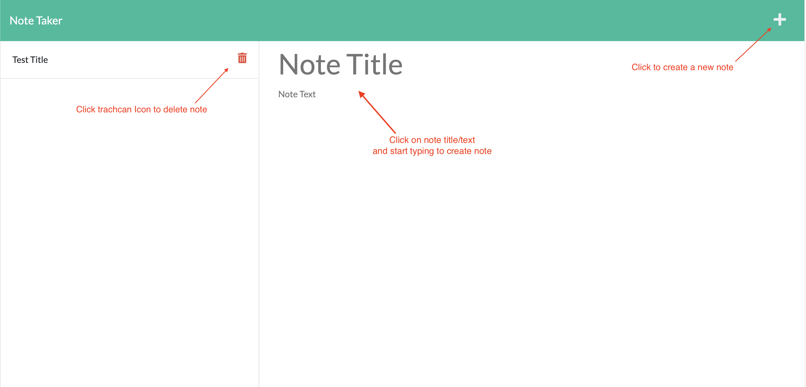

# Note Taker Application
This application will use an Express.js back end and will save and retrieve note data from a JSON file.

## Description
This challenge was intended to test our knowledge of foundational server side functions using Express. The front end code was provided and we were tasked with building the server side code.

## How to use
From the landing page click on "Get Started" to be redirected to the notes page.

Once on the notes page you will see a list of all notes on the left side. In the main panel you will have the option to create new note by clicking on the empty note title/text and start typing to create a new note. Once a new note is selected there will be a save icon that will appear, click this to save the current note to the json db file.

## What I learned
* Basic server environment and CRUD operations using Express.
* I enjoy working with and building server side API code

## Future development
I don't have plans to develop this code in the future, this was a helpful exercise to learn about Express and I will revisit if I need a refresher!

## Credits
Thanks to the University of Texas and my instructor Leah.

## Contact me
Email: [matthewthomsen99@gmail.com](mailto:matthewthomsen99@gmail.com)

## License
MIT License

Copyright (c) 2022 Matt

Permission is hereby granted, free of charge, to any person obtaining a copy
of this software and associated documentation files (the "Software"), to deal
in the Software without restriction, including without limitation the rights
to use, copy, modify, merge, publish, distribute, sublicense, and/or sell
copies of the Software, and to permit persons to whom the Software is
furnished to do so, subject to the following conditions:

The above copyright notice and this permission notice shall be included in all
copies or substantial portions of the Software.

THE SOFTWARE IS PROVIDED "AS IS", WITHOUT WARRANTY OF ANY KIND, EXPRESS OR
IMPLIED, INCLUDING BUT NOT LIMITED TO THE WARRANTIES OF MERCHANTABILITY,
FITNESS FOR A PARTICULAR PURPOSE AND NONINFRINGEMENT. IN NO EVENT SHALL THE
AUTHORS OR COPYRIGHT HOLDERS BE LIABLE FOR ANY CLAIM, DAMAGES OR OTHER
LIABILITY, WHETHER IN AN ACTION OF CONTRACT, TORT OR OTHERWISE, ARISING FROM,
OUT OF OR IN CONNECTION WITH THE SOFTWARE OR THE USE OR OTHER DEALINGS IN THE
SOFTWARE.
